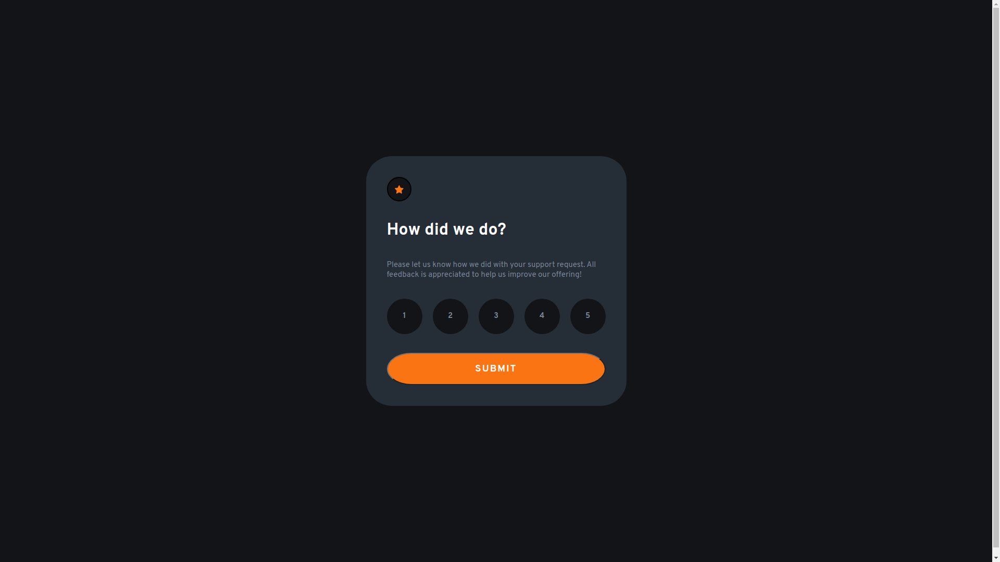

# Frontend Mentor - Interactive rating component solution

This is a solution to the [Interactive rating component challenge on Frontend Mentor](https://www.frontendmentor.io/challenges/interactive-rating-component-koxpeBUmI). Frontend Mentor challenges help you improve your coding skills by building realistic projects. 

## Table of contents

- [Overview](#overview)
  - [The challenge](#the-challenge)
  - [Screenshot](#screenshot)
  - [Links](#links)
- [My process](#my-process)
  - [Built with](#built-with)
  - [What I learned](#what-i-learned)
  - [Continued development](#continued-development)
  - [Useful resources](#useful-resources)
- [Author](#author)

## Overview

### The challenge

Users should be able to:

- View the optimal layout for the app depending on their device's screen size
- See hover states for all interactive elements on the page
- Select and submit a number rating
- See the "Thank you" card state after submitting a rating

### Screenshot

### Links

- Solution URL: [[Add solution URL here](https://your-solution-url.com)](https://github.com/jGarridor/Interactive-rating-component/)
- Live Site URL: [[Add live site URL here](https://your-live-site-url.com)](https://jgarridor.github.io/Interactive-rating-component/)

## My process

### Built with

- Semantic HTML5 markup
- CSS custom properties
- Flexbox
- CSS Grid
- Vanilla JavaScript

### What I learned

This is my first challenge of "Frontend Mentor" using vanilla Javascript. I could recall some usefull techniques and approaches in order to add interactivity to the page.

The script has three principal functions that determine, respectively, how to select a scale, how to deselect it and to write and rewrite the message; which is going to tell the user what option was selected. It has two 'event listeners' that will control the behavior of the pag, once the user click on the scales or the submit button.

Practically, this exercise help me to reconnect with JavaScript implementation in a website/webpage.

### Continued development

My person tried to module the script, such that every step or function could be properly defined and distinguishable from the rest of the functionalities. What would have been a better approach? In order to minimize the occurrence of bugs and improve the maintenance of the page.

### Useful resources

- blog.javascripttoday.com
- masteringjs.io
- dmitripavlutin.com
- www.w3schools.com

This pages help me to recall how to work with javasript.

## Author

- Frontend Mentor - [@jGarridor](https://www.frontendmentor.io/profile/jGarridor)

